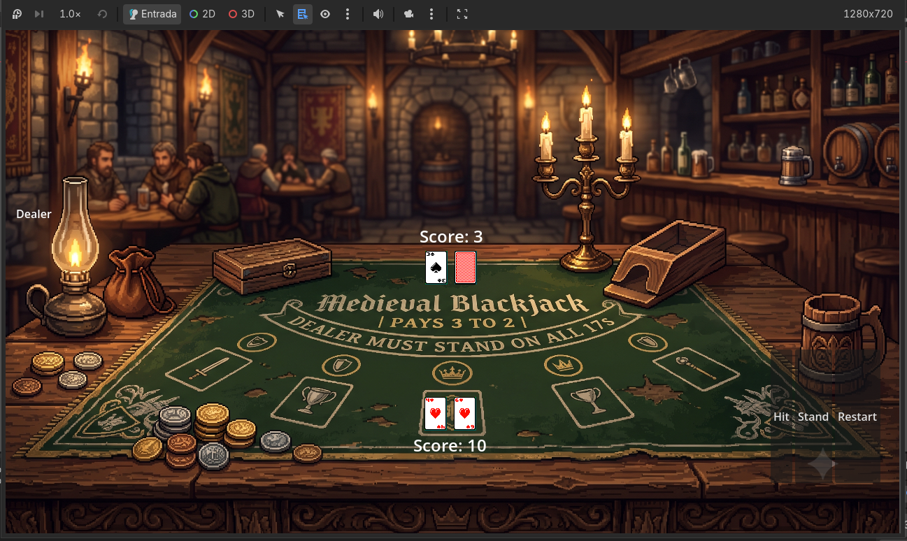

# Fantasy Blackjack

Fantasy Blackjack es un proyecto personal desarrollado con Godot 4 como parte de proceso de aprendizaje en desarrollo de videojuegos.

El objetivo inicial fue implementar una versión funcional del Blackjack clásico, poniendo énfasis en una buena organización del código y una arquitectura sencilla que permita seguir ampliando el proyecto. A futuro, la idea es evolucionarlo hacia un juego de cartas con ambientación de fantasía medieval, incorporando nuevas mecánicas inspiradas en títulos como Balatro.

## Características actuales

- Juego completo de Blackjack contra un dealer.
- Sistema de cartas mediante sprites.
- Dealer con segunda carta oculta.
- reparto secuencial de cartas.
- Cáculo automático del valor de la mano (incluyendo As).
- Reinicio de partidas.
- Interfaz grafica basica basada en mesa de juego medieval

## Tecnologías utilizadas

- Godot 4
- GDScript
- Git
- GitHub

## Estructura del proyecto

```
.
├── assets/
├── audio/
├── fonts/
├── scenes/
├── scripts/
│   ├── deck.gd
│   └── game_manager.gd
└── project.godot
```

El proyecto está organizado separando la lógica del mazo de la lógica principal del juego, facilitando futuras ampliaciones y el mantenimiento del código.

## Próximas mejoras

- Añadir animaciones para el movimiento y revelado de las cartas.
- Incorporar efectos de sonido y música ambiental.
- Mejorar el feedback visual de botones y resultados.
- Implementar un sistema de apuestas y fichas.
- Añadir estadísticas de partidas (victorias, derrotas y rachas).
- Diseñar eventos, reliquias y modificadores de reglas.
- Evolucionar el proyecto hacia un juego de progresión tipo roguelite.

## Cómo ejecutar el proyecto

1. Clonar el repositorio.

```bash
git clone https://github.com/TU_USUARIO/fantasy-blackjack.git
```

2. Abrir el proyecto con Godot 4.
3. Ejecutar la escena principal.

 ## Capturas

 ###Version jugable actual v0.2.0

